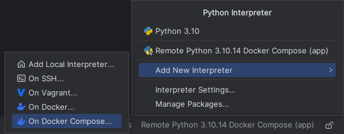
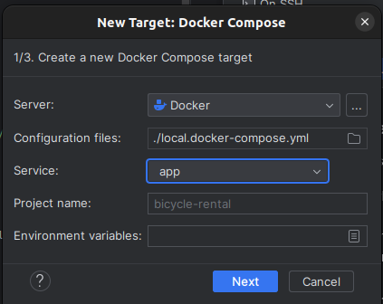
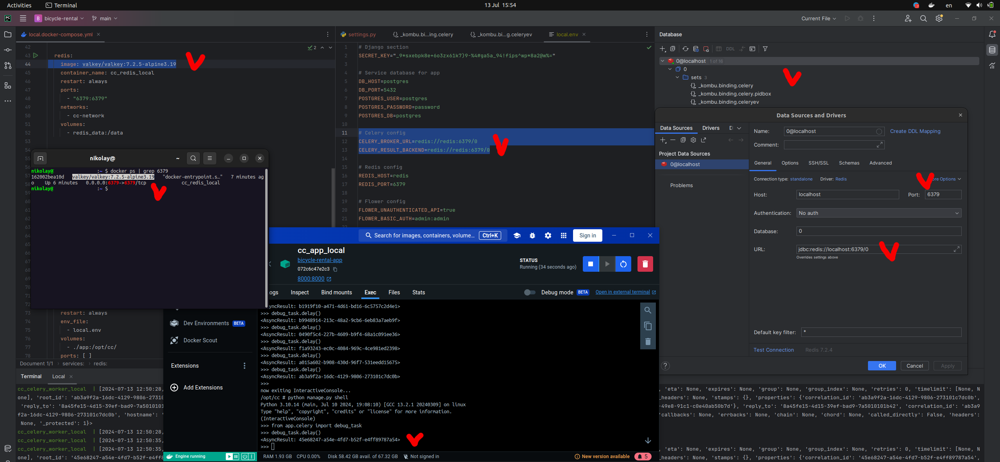
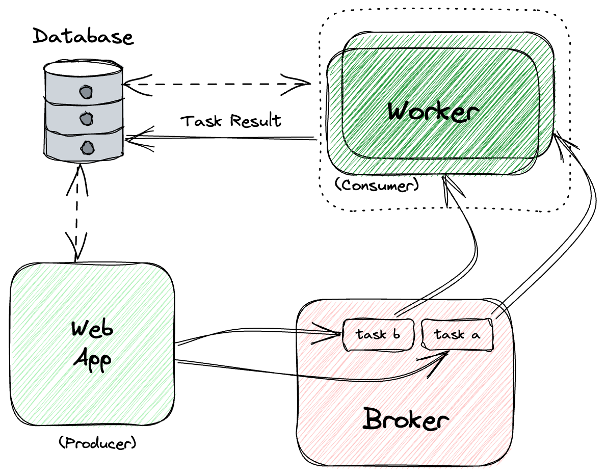
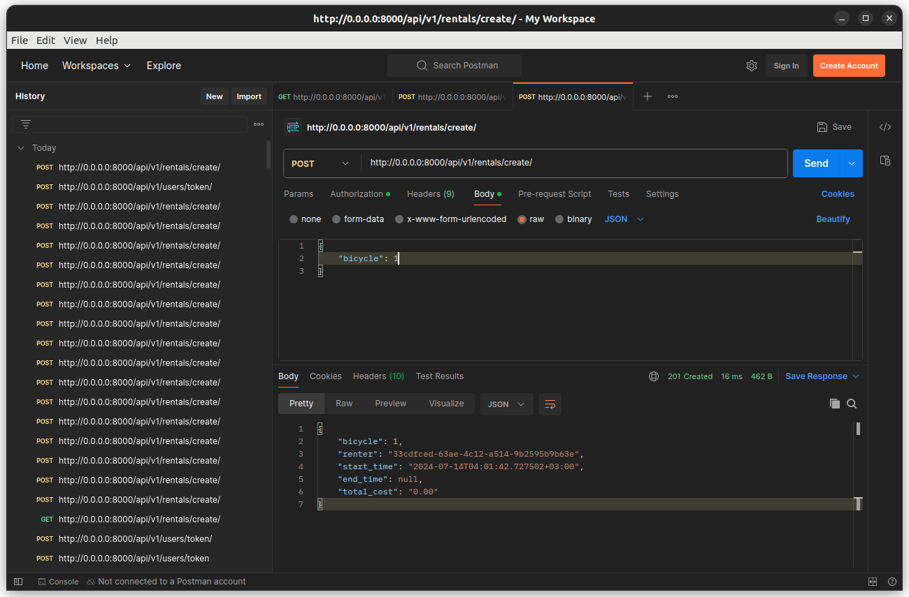
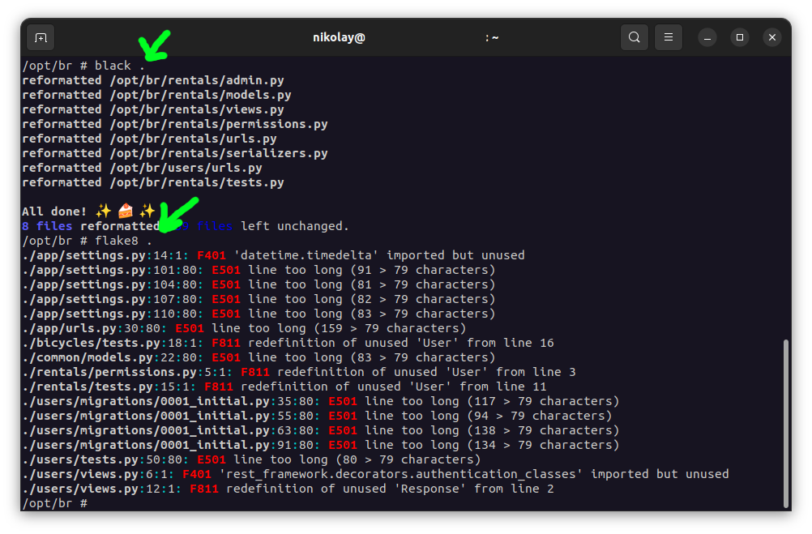
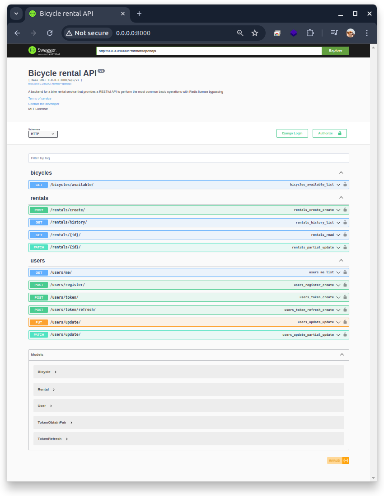
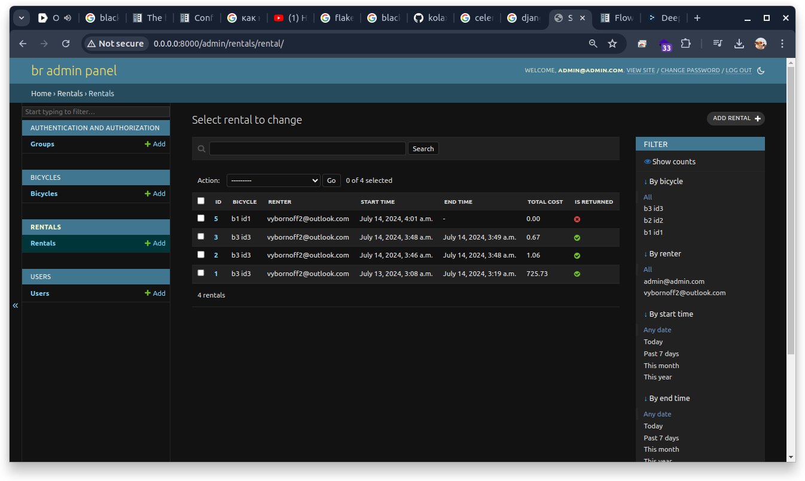
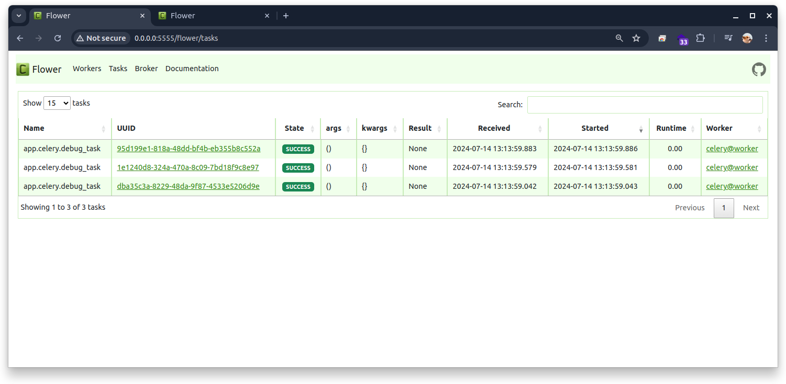

# Bicycle rent

A backend for a bike rental service that provides a RESTful API to perform the most common basic operations with Redis
license bypassing

## Tech info

## Docker configuration

- local (can be used in the local development and test section of CI)
- non-local (used in the server part)

### Dockerfile

This Dockerfile configures a lightweight Python 3.10 environment using Alpine Linux.
It sets environment variables to optimize Python behavior and exposes port 8000 for the application.
It copies (local.)requirements.txt to /opt/requirements.txt and updates the package list before installing Bash.
The Dockerfile then creates a directory structure under /opt/br, sets up a Python virtual environment, and installs
dependencies from (local.)requirements.txt using pip with specific flags to disable isolation and version checks.
It ensures the /opt directory and its subdirectories have appropriate permissions.
Subsequently, it copies multiple start and entrypoint scripts from the (local) compose directory into the container,
corrects line endings using sed, and makes these scripts executable.
The PATH environment variable is updated to include the virtual environment's binary directory.
Finally, it copies the application code to /opt/br/, sets this as the working directory, and defines /entrypoint as the
container's entry point.

### docker-compose

Local version as example

```shell
CONTAINER ID   IMAGE                            COMMAND                  CREATED        STATUS          PORTS                              NAMES
3ec1d5e1284f   bicycle-rental-flower            "/entrypoint /start-…"   10 hours ago   Up 27 minutes   0.0.0.0:5555->5555/tcp, 8000/tcp   br_flower_local
efc5ce11fb39   bicycle-rental-app               "/entrypoint /start"     10 hours ago   Up 27 minutes   0.0.0.0:8000->8000/tcp             br_app_local
438b786afe33   bicycle-rental-celery_beat       "/entrypoint /start-…"   10 hours ago   Up 27 minutes   8000/tcp                           br_celery_beat_local
8944007733e9   bicycle-rental-celery_worker     "/entrypoint /start-…"   10 hours ago   Up 27 minutes   8000/tcp                           br_celery_worker_local
b017c3b1b514   postgres:13-alpine               "docker-entrypoint.s…"   10 hours ago   Up 15 minutes   0.0.0.0:5432->5432/tcp             br_postgres_local
859ad49b6de9   valkey/valkey:7.2.5-alpine3.19   "docker-entrypoint.s…"   10 hours ago   Up 27 minutes   0.0.0.0:6379->6379/tcp             br_redis_local

```

In the local project configuration, the app folder on your machine is mounted as a volume to the app folder in the
container.
This allows you to make changes to the code and see the updates immediately.
Additionally, you can use the remote Python interpreter from the container in your IDE, ensuring a convenient and
efficient development process.



Next choose local.docker-compose.yml



### Python 3.10 on alpine

One image for 4 containers (shared style, build 1 time and up via different commands)

- Django as web framework
- Celery as worker.
- Celery Beat as scheduler
- Flower to monitor and control tasks + export to Grafana via API.

### PostgreSQL 13 on alpine

- Container with shared volume
- Default user for Django
- Default config light version
- Local version JDBC connection string - `jdbc:postgresql://localhost:5432/postgres`. Connect with your favourite DBC.
  Port from the Docker container - `5432`. You can use DataGrip e.g.

### Valkey (Redis opensource fork)


This demonstrates a seamless replacement of Redis due to a license change.

- KV for celery
- Cache to reduce database usage
- Local version JDBC connection string - `jdbc:redis://localhost:6379/0`. Connect with your favourite DBC. Port from the
  Docker container - `6379`. You can use Another Redis Desktop Manager e.g.

### Python dependencies

To manage dependencies in this project, I chose to use pip and a simple requirements.txt file.
There is no need for a private repository such as Nexus, since all dependencies are available in the public PyPI
repositories.
A small list of dependencies allows for efficient use of the simple file, as well as easy installation and updating of
libraries.

- **Django 5.0.7** - High-level Python web framework for rapid development and clean design.
- **Django REST framework 3.15.2** - Powerful and flexible toolkit for building Web APIs.
- **djangorestframework-simplejwt 5.3.1** - JSON Web Token authentication for Django REST framework.
- **celery 5.4.0** - Distributed task queue for real-time processing.
- **flower 2.0.1** - Web-based tool for monitoring and administrating Celery clusters.
- **psycopg2-binary 2.9.9** - PostgreSQL database adapter for Python; binary package, no compilation needed.
- **redis 5.0.7** - In-memory data structure store used as a database, cache, and message broker.
- **black 24.4.2** - Uncompromising Python code formatter ensuring consistent style.
- **flake8 7.1.0** - Tool for enforcing Python style guide and checking code quality. (used in CI job)
- **coverage 7.6.0** - A tool for measuring code coverage of Python programs.
- **drf-ysdg** - A Swagger / OpenAPI 2 generation tool implemented without using the schema generation provided by
  Django Rest Framework

## Celery




Celery is a simple, flexible, and reliable distributed system to process vast amounts of messages, while providing
operations with the tools required to maintain such a system.
It’s a task queue with focus on real-time processing, while also supporting task scheduling.

In this project you can import `@task` decorator and call this function with, e.g. `.delay()`

[Documentation](https://docs.celeryq.dev/en/stable/index.html)

## Celery Beat

celery beat is a scheduler; It kicks off tasks at regular intervals, that are then executed by available worker nodes in
the cluster.

By default the entries are taken from the beat_schedule setting, but custom stores can also be used, like storing the
entries in a SQL database.

You have to ensure only a single scheduler is running for a schedule at a time, otherwise you’d end up with duplicate
tasks. Using a centralized approach means the schedule doesn’t have to be synchronized, and the service can operate
without using locks.

Use it like a CRON to send daily reports, messages ect.

[Documentation](https://docs.celeryq.dev/en/stable/userguide/periodic-tasks.html)

## Flower

Flower is an open-source web application for monitoring and managing Celery clusters. It provides real-time information
about the status of Celery workers and tasks.

## Testing section

You can manually test application from your docker container before pushing.

### CI:

- Lint test.
- Code test
- Coverage report

```shell
docker exec -it br_app_local sh
```

```shell
coverage run --source='.' manage.py test
```

To see results in your console

```shell
coverage report
```

To generate results in the hidden htmlcov folder

```shell
coverage html
```

To see HTML report at your browser cd to the `/bicycle-rental/app` directory at your system or just open generated HTML
file:

```shell
xdg-open htmlcov/index.html
```

### Test API with Postman



### Lint test and code quality

Manually in container. This will make code prettier. You can change config at `app/pyproject.toml`

```shell
black .
``` 

Then check with Flake8. You can change config at `setup.cfg`

```shell
flake8 .
```



Fix all mistakes and continue your important development.

## Local development

Make sure that you have Docker engine.

```shell
git clone @github.com:kolaxy/bicycle-rental.git
```

```shell
cd bicycle-rental && docker compose up -d 
```

- `http://0.0.0.0:8000/` - Swagger documentation
  
- `http://0.0.0.0:8000/` - ADMIN Panel. Create your superuser with `python manage.py createsuperuser` in your container.
  
- `http://0.0.0.0:5555/flower` - Flower to track celery tasks
  

### Endpoints

#### Bicycles

- GET /bicycles/available/ - Retrieve available bicycles.

#### Rentals

- POST /rentals/create/ - Create a new rental.

- GET /rentals/history/ - Retrieve rental history.

- GET /rentals/{id}/ - Retrieve a rental by ID.

- PATCH /rentals/{id}/ - Partially update a rental.

#### Users

- GET /users/me/ - Retrieve authenticated user's email.

- POST /users/register/ - Register a new user.

- POST /users/token/ - Obtain JWT tokens.

- POST /users/token/refresh/ - Refresh JWT tokens.

- PUT /users/update/ - Update user information.

- PATCH /users/update/ - Partially update user information.